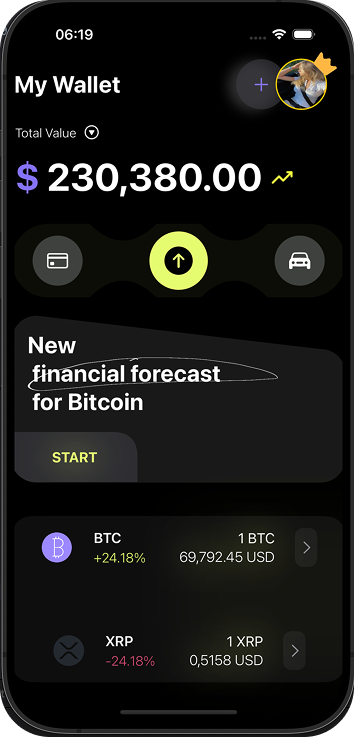
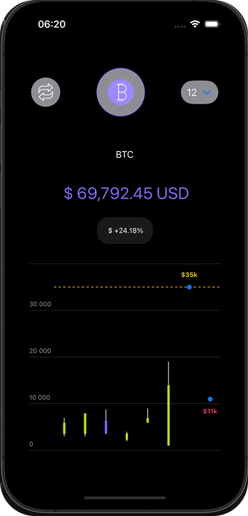

# 💰 Crypto Portfolio App (SwiftUI)
## 📱 App Screenshots

Here are some sample screenshots from the app:

### 🔸 Home View


### 🔸 Cripto info View



This is a **SwiftUI-based cryptocurrency portfolio application** designed to visually present mock crypto data in a sleek and elegant interface. It incorporates custom shapes, reusable views, and animated elements to simulate a crypto tracking experience. Although it uses mock data, the app structure is easily extendable to support real APIs.

---

## ✨ Features

- ✅ **Crypto List View** with tap interactions
- ✅ **Bottom Sheet Modal** showing detailed crypto info
- ✅ **Custom TransferView** with capsule-shaped background
- ✅ **Total Portfolio Value View**
- ✅ Beautiful custom shapes and reusable components
- ✅ Preview support using SwiftUI `#Preview`
- ✅ Light animation and clean UI design

---

## 🧱 Tech Stack

- **Language**: Swift
- **Framework**: SwiftUI
- **Platform**: iOS 16.0+
- **Architecture**: MV-like separation with reusable views
- **Design**: Minimalistic and visually intuitive

---

## 📱 Screens and Views

### 1. `CryptoListView`
A list of mock cryptocurrencies, each with:
- Icon image
- Name
- Price
- Percentage change (colored red or yellow)
- Navigation to a **Bottom Sheet** when tapped

### 2. `BottomSheetView`
Presents selected crypto's:
- Name
- Price
- Daily Change (with color indication)

### 3. `TransferView`
Custom `ZStack` layout containing:
- Central button with `arrow.up.circle.fill`
- Side buttons using `Circle` and `SF Symbols`
- A **CustomCapsuleShape** with smooth dips (like a dynamic TabBar)

### 4. `TotalValueView`
Simple display of total crypto portfolio value with stylized currency and branding.

---

## 🖼 Mock Data

All crypto data is locally hardcoded in the `Crypto` struct:
```swift
let cryptoList: [Crypto] = [
    Crypto(name: "BTC", price: "69,792.45 USD", change: "+24.18%", nameQuantity: "1 BTC", image: "bitcoin"),
    Crypto(name: "XRP", price: "0,5158 USD", change: "-24.18%", nameQuantity: "1 XRP", image: "xrp")
]
